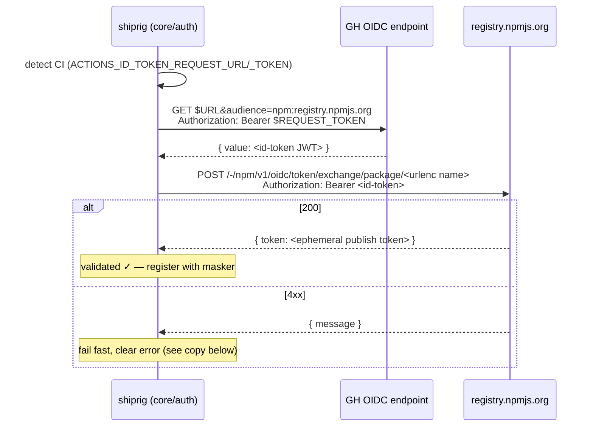

# Publish auth: OIDC trusted publishing + secret-manager refs — design

> Status: **IN PROGRESS** (2026-06-15). Decisions locked with John: **Go-native
> OIDC exchange with token fallback**, and **one general auth seam** (npm first,
> NuGet/crates plug in later). Implemented on branch `feat/publish-auth`:
> slices 1–3 (secret-ref/1Password path, GitHub+GitLab OIDC exchange, provenance
> gate) and the OIDC CI example. Remaining: the `release-init` wizard ergonomics
> (slice 4) and NuGet/crates adapters (slice 5). See the slice list at the end.

## Goals

1. **Tokenless publishing in CI** — `shiprig publish` from GitHub Actions / GitLab
   CI authenticates to npm via OIDC trusted publishing. No `NPM_TOKEN` secret,
   no OTP, automatic provenance. The CI identity *is* the second factor.
2. **Frictionless local publishing** — a human on a laptop resolves npm auth from
   a secret manager (1Password `op://…`, or any command) just-in-time, instead of
   a long-lived token in their shell. Covers the OTP-on-every-publish reality of
   publishing *as yourself*.
3. **One general seam, not an npm special case** — auth resolution is a core
   policy (OIDC → secret-ref → env token) that every ecosystem shares. npm is the
   first registry to implement OIDC exchange; NuGet and crates.io (both now have
   trusted publishing) slot into the same seam without re-plumbing.
4. **Fail fast, never half-release** — auth is validated *before* the publish loop
   starts. A misconfigured trusted publisher fails with a clear message, not a
   partial release mid-loop. (This is the gap npm/cli#8525 leaves open for tools
   that only shell out to `npm publish`.)
5. **No regressions** — when nothing is configured, behaviour is exactly today's:
   the adapter runs `npm publish` against the caller's ambient `~/.npmrc`.

## Current state (grounding)

- `node.Adapter.Publish` (`core/ecosystem/node/node.go:173`) does a `npm view`
  idempotency read, then `npm publish --access …`. Comment at `:171` is explicit:
  *"npm uses the caller's npm auth (~/.npmrc / NPM_TOKEN), which we do not manage
  here."* **No `whoami`/`access` preflight** — so shiprig is already closer to
  OIDC-compatible than release-it (which gates publish behind a token-based
  `npm whoami`).
- `publish` CLI (`internal/shiprig/cli/publish.go:71`) builds a `PublishRequest`
  per package and calls `eco.Publish`. Confirm gate skips on `--yes`/non-TTY.
- `PublishRequest` (`core/plugin/protocol.go:166`) carries
  `{RepoRoot, Package, PackageSource, Access, DryRun}` — **no auth field today**.
- Secret machinery already exists: lazy `vars` resolve a `command` (e.g.
  `op item get … --otp`) on first use and register the value with `SecretMasker`
  (`internal/shiprig/pipeline/vars.go:64`, `:84`). This is the reuse target for
  the secret-ref path.
- `node.ReleaseInit` (`node.go:253`) declares a single `NPM_TOKEN` `TokenSpec`;
  the wizard reports set/missing but never reads it.
- Example CI (`examples/github-workflows/release.yml`) injects `NPM_TOKEN` via
  `env:`. No `id-token` permission, no provenance.

## The model: three identities, one precedence chain

The whole design follows from *who is publishing* (see the OTP analysis that
motivated this):

| Identity | OTP? | Secret stored | Resolution method |
|---|---|---|---|
| CI runner (no human) | no | none | **OIDC** trusted publishing |
| You, locally | yes (as yourself) | none | **secret-ref** → token/OTP from `op://` |
| Automation (token) | no | long-lived token | **env token** (`NPM_TOKEN`) |

shiprig resolves auth for a package's registry by walking this precedence, first
match wins:

```mermaid
flowchart TD
    A["resolve(registry, ecoConfig)"] --> B{OIDC context<br/>available for this registry?}
    B -- yes --> O["OIDC exchange → ephemeral token<br/>provenance = on"]
    B -- no --> C{auth ref configured?<br/>(op:// / command)}
    C -- yes --> S["run ref → token/OTP<br/>register with masker"]
    C -- no --> D{env token set?<br/>(NPM_TOKEN)}
    D -- yes --> E["env token"]
    D -- no --> N["none → ambient ~/.npmrc<br/>(today's behaviour)"]
```

- **OIDC is auto and first** in CI — the happy path needs zero config beyond the
  one-time npmjs.com trusted-publisher setup + `id-token: write`.
- **`oidc: off`** in config forces the chain to skip OIDC (escape hatch for
  custom registries or debugging).
- OIDC is only ever attempted against the **official registry**
  (`registry.npmjs.org`) — never a custom `packageSource` (mirrors
  semantic-release's `OFFICIAL_REGISTRY === registry` gate).

## OIDC exchange — the Go-native flow (Strategy B)

shiprig performs the exchange itself rather than relying on `npm` ≥ 11.5.1 to do
it. This removes the npm-version floor for *auth*, and gives us a real
pre-publish validation point. Mechanics mirror `semantic-release/npm`'s
`trusted-publishing/token-exchange.js`, reimplemented in Go:



Provider detection (general, in `core/auth`):
- **GitHub Actions** — `ACTIONS_ID_TOKEN_REQUEST_URL` + `ACTIONS_ID_TOKEN_REQUEST_TOKEN`
  present. Fetch id-token: `GET {URL}&audience={aud}` with bearer
  `{REQUEST_TOKEN}`, read `.value`.
- **GitLab CI** — `NPM_ID_TOKEN` present (user configures `id_tokens` with
  `aud: npm:registry.npmjs.org` in `.gitlab-ci.yml`). Use it directly.
- Neither present → no OIDC context; fall through the chain.

The npm-specific bits (audience string `npm:registry.npmjs.org`, exchange URL
`{registry}-/npm/v1/oidc/token/exchange/package/{name}`) are registered by the
**node adapter**, not hardcoded in core — that's what keeps the seam general.

### Provenance is layered on top of auth

Auth via the exchanged token works on any npm. **Provenance** still needs the npm
CLI's attestation machinery, so it stays best-effort and version-gated:

- shiprig leaves the CI OIDC env vars in place (GHA already sets them) and, when
  `method == OIDC`, passes `--provenance` to `npm publish` **iff** the runner's
  `npm` ≥ 11.5.1. The CLI then builds + uploads the provenance bundle using the
  ambient OIDC identity.
- Older npm → publish succeeds (tokenless auth), provenance is skipped, and we
  log one line saying so. Auth never depends on the npm version; only the
  provenance attestation does.
- Provenance is off for private repos / self-hosted / CircleCI (npm limitation) —
  we detect and note rather than fail.

## Auth seam — where the code lives

**Decision: core resolves the credential *value*; the adapter renders its own
ecosystem-native credentials file.** This keeps the precedence *policy* general
and the registry *specifics* (file format, exchange endpoint) in the adapter,
while reusing the existing `op://` + masker machinery.

- New `core/auth` package:
  - `IDTokenProvider` — CI detection + raw id-token fetch for an audience (general).
  - `Resolve(ctx, Request) (Credential, error)` — walks the precedence chain,
    registers any secret with the `SecretMasker`, returns
    `Credential{Token, Method, Provenance}`. The OIDC audience/endpoint come from
    a small per-registry registration the node adapter provides.
  - Secret-ref path reuses the lazy-var resolver (`op read op://…`, or any
    `command`) so 1Password support is literally already built — we're promoting
    it from hand-wired `vars` to a first-class `auth` field.
- Protocol delta — `PublishRequest` gains:
  ```go
  Auth *AuthCredential `json:"auth,omitempty"` // resolved; nil = ambient (today)
  // AuthCredential{ Token string; Method string; Provenance bool }
  ```
- Adapter side — when `req.Auth != nil`, the node adapter writes a 0600 temp
  npmrc (`//registry/:_authToken=<token>`), runs `npm publish --userconfig <tmp>`
  (+ `--provenance` per the version gate), and deletes the temp file. dotnet
  renders a `NuGet.config`; cargo a credentials file — same `Auth` shape, native
  format. Adapters that get `Auth == nil` behave exactly as today.

> **Security note (deliberate, documented):** the resolved token transits the
> plugin protocol (core → adapter stdin, local only, never logged, masked). The
> alternative — passing a file path — was rejected because it forces core to know
> each ecosystem's credentials-file format, defeating the general seam. Temp
> credentials files are 0600 and removed in a deferred cleanup.

### Pre-flight validation (fail fast)

Before the publish loop, the `publish` CLI resolves auth for every
to-be-published package's registry. For OIDC that means the exchange actually
runs up front — a bad trusted-publisher config fails here, before any package
ships. (Optional follow-up: a `VerifyAuth` plugin capability so each ecosystem
can run its own cheap check; not required for v1 since the exchange itself is the
check for npm.)

## User-facing surface

### Config — `.changeset/release.jsonc`

A general `auth` block on the per-ecosystem config (`EcoConfig`), not npm-only:

```jsonc
{
  "npm": {
    // "oidc" (force) | "auto" (default: OIDC in CI, else chain) | "off"
    "oidc": "auto",
    // secret-manager ref or command for the local/automation path
    "auth": "op://CI/npm/token",     // or "env:NPM_TOKEN" (default), or omit
    "provenance": "auto"             // auto (default) | always | never
  }
}
```

`auth` accepts `op://…` (shorthand for `op read`), `env:NAME`, or a full
`command` array — the same resolver as today's lazy `vars`.

### CLI flags (override config)

- `--npm-auth <op://… | env:NAME>` — one-off auth ref.
- `--oidc <auto|off>` — force-disable OIDC for a run.
- `--provenance` / `--no-provenance` — override the provenance gate.

### What CI looks like (OIDC)

One-time on npmjs.com: Package → Settings → Trusted Publisher → GitHub Actions →
repo + workflow filename. Then:

```yaml
permissions:
  contents: write
  id-token: write                                   # ← the only required addition
jobs:
  release:
    steps:
      - uses: actions/checkout@v4
      - uses: actions/setup-node@v4
        with: { registry-url: https://registry.npmjs.org }
      - run: shiprig publish --yes
        env:
          GITHUB_TOKEN: ${{ secrets.GITHUB_TOKEN }}
          # NPM_TOKEN deleted
```

Log on success:
```
published @acme/widget@1.4.0  via OIDC trusted publishing · provenance attested
```

### What local looks like (1Password)

```bash
shiprig publish --npm-auth op://CI/npm/token
```
```
published @acme/widget@1.4.0
  ↳ npm token resolved from 1Password (op://CI/npm/token)
```
Token is fetched at the moment of publish, never on disk in plaintext, masked in
all output. If the account requires OTP and the configured ref is an *automation*
token, OTP is bypassed; if it's a user token, an `op item get npm --otp` ref
supplies a fresh OTP.

### Failure copy (OIDC misconfig — the fail-fast win)

```
✗ npm OIDC token exchange rejected (403 Forbidden)
  @acme/widget is not configured for trusted publishing from
    repo:     acme/widget
    workflow: .github/workflows/release.yml
  Fix: add this workflow as a Trusted Publisher, or set NPM_TOKEN to fall back.
  → https://www.npmjs.com/package/@acme/widget/access
```

Other cases: missing `id-token: write` → *"no OIDC token available — did you grant
`id-token: write` to this job?"*; old npm + provenance → *"published; provenance
skipped (needs npm ≥ 11.5.1, runner has 10.8.2)."*

## `release-init` wizard changes

- Emit an **OIDC-shaped** `release.yml` (the block above): `id-token: write`,
  `registry-url`, no `NPM_TOKEN`.
- `node.ReleaseInit`: make the `NPM_TOKEN` `TokenSpec` **conditional** — when
  `npm.oidc != "off"`, present it as *optional fallback* rather than required, and
  add a `Note` with the npmjs.com trusted-publisher setup steps (the one thing
  shiprig can't do for the user).
- Wizard preflight: detect npm version and warn if < 11.5.1 (provenance only).

## Limitations & non-goals

- **OIDC: official npm registry only.** Custom registries / GitHub Packages use
  the secret-ref or env path. (NuGet/crates OIDC are future adapters on the same
  seam.)
- **Provenance** needs npm ≥ 11.5.1, a public repo, and a hosted runner — best
  effort, never blocks auth.
- **Staged publishing** (npm's human-approval queue) is out of scope: an OIDC
  token can publish to the stage but *cannot approve* it by design. If a package
  enforces staging, shiprig publishes to the stage and reports that a human must
  approve.
- **One trusted publisher per package** (npm constraint) — surfaced in docs, not
  enforced by shiprig.

## Build slices

1. ✅ **`core/auth` seam + secret-ref path.** `core/auth` resolver + precedence,
   `Redactor`, `PublishRequest.Auth`, node adapter renders a temp npmrc seeded
   from the existing one (no clobber) via `NPM_CONFIG_USERCONFIG`. `--npm-auth`
   flag + `npm.auth` config (`op://` / `env:` / `cmd:`). Ships the 1Password/local
   story standalone. *Built; unit-tested.*
2. ✅ **OIDC exchange (GitHub Actions + GitLab).** `core/auth` id-token fetch
   (`HasOIDCContext`, `FetchIDToken`), npm-specific exchange in the node adapter
   (`POST …/-/npm/v1/oidc/token/exchange/package/<name>`), CLI precedence
   (explicit ref wins, else OIDC when context present and not `off`), fail-fast
   error copy. `npm.oidc` config. *Built; httptest-covered end-to-end.*
3. ✅ **Provenance gate.** `npm --version` detection (≥ 11.5.1), `--provenance`
   on the OIDC path only, skip-note when too old. *Built; unit-tested.*
4. ✅ **Wizard + CI templates.** OIDC `release.yml`; `ReleaseInitRequest.OIDC` +
   node `ReleaseInit` drops the required `NPM_TOKEN` and emits trusted-publisher
   setup notes when OIDC is in play. (A live npm-version warning in the preflight
   was dropped — local npm ≠ CI npm, so it would mislead; the static "provenance
   needs npm ≥ 11.5.1" note covers it.)
5. ⬜ **NuGet/crates OIDC adapters** — *feasibility confirmed, recommend separate
   PRs* (the seam is ready; GitLab id-token already handled in `FetchIDToken`):
   - **crates.io** — Trusted Publishing GA (RFC 3691). Exchange the GH/GitLab
     OIDC JWT (audience per the RFC) at crates.io's trusted-publishing token
     endpoint for a ~30-min token; `cargo publish` consumes it via
     `CARGO_REGISTRY_TOKEN`. Lives in the cargo adapter; `core/auth` id-token
     fetch is reused.
   - **NuGet.org** — Trusted Publishing GA (GitHub Actions only today). Exchange
     the OIDC token for a temporary ~1-hour API key; `dotnet nuget push` consumes
     it. Lives in the dotnet adapter. Not available for private feeds / Azure
     Artifacts.
   Each is a distinct exchange protocol + adapter publish path, so they belong in
   their own PRs rather than the npm-focused one (#88).

## Open questions

1. **Token across the protocol vs. file path.** Doc commits to passing the token
   value (general seam, masked). Confirm that's acceptable vs. core writing the
   credentials file (leaks ecosystem file-format knowledge into core).
2. **Separate `VerifyAuth` capability?** v1 treats the OIDC exchange as the check.
   Worth a dedicated capability for ecosystems whose auth check ≠ a side effect?
3. **`auth` config home.** Per-ecosystem `EcoConfig.auth` (proposed) vs. a
   top-level `auth` map keyed by registry. Per-ecosystem matches existing
   `packageSource`; revisit if registries get shared across ecosystems.
