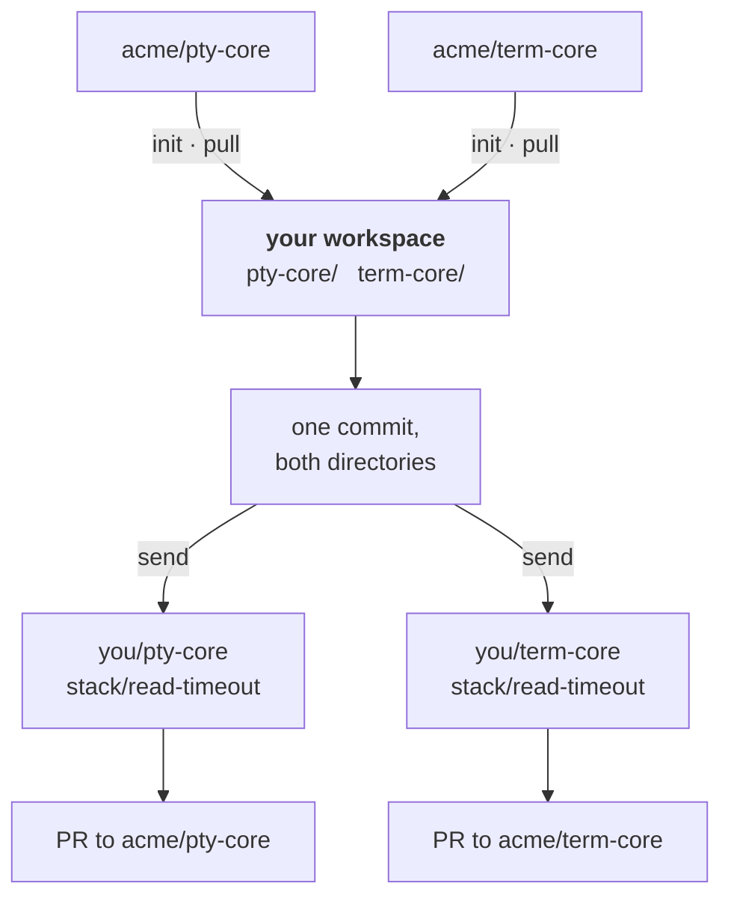
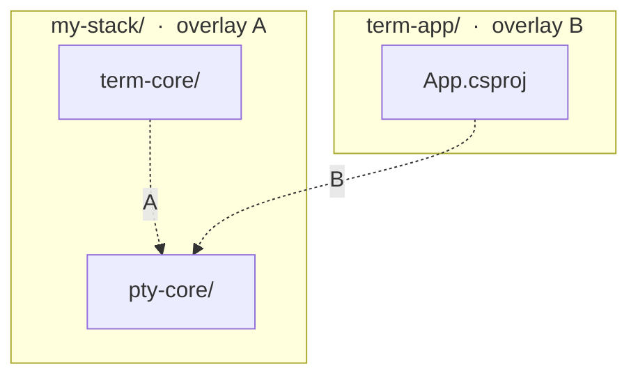
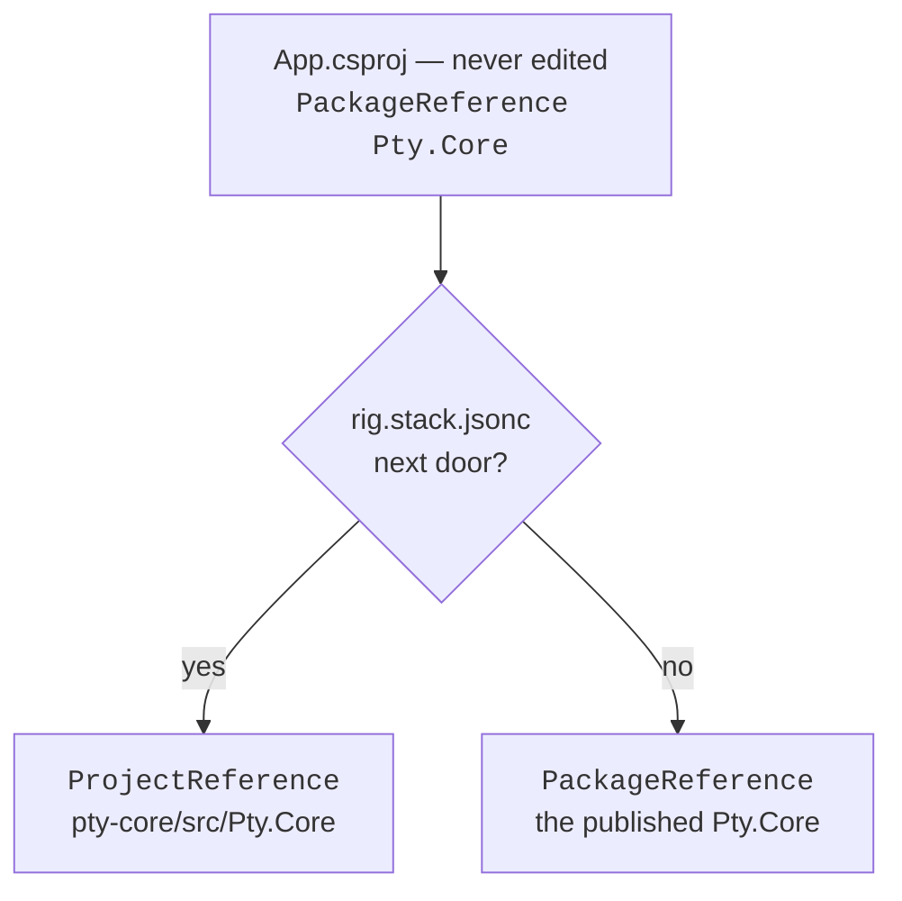

# Stack workspaces

Some projects only make sense together — an app, and the libraries it depends
on that you have had to fork. Iterating across that boundary means publishing a
package to see a change land, and a change that spans the repos cannot be one
commit.

A **stack workspace** fuses the forked repos into one git history, each under
its own directory. A change spans them in a single commit, the build compiles against
source rather than packages, and each project still leaves as an ordinary pull
request against its own upstream. Upstream never learns the workspace exists.

## The two halves

Two independent problems, two independent solutions. You need both, and they
know nothing about each other.

**The git half.** Each upstream repo's history is imported into one workspace
repo, rewritten to live under a prefix directory. That is
[josh](https://josh-project.dev) doing reversible history filtering; rig drives
it as a throwaway localhost process and does everything else with plain git.
Because it is one repo, one commit can touch every project in it.

The whole round trip, for two of the repos:



The two sides of that round trip are not symmetric. **Import** and `pull` are josh
driving a reversible `:prefix=` filter. **Send** uses no engine at all: the
directory's tree is already what upstream wants, so the export is a plain
`git commit-tree` onto the upstream tip.

**The build half.** If the projects depend on each other through a package
registry, your edits do not reach the consumer without a publish cycle. A build
file sitting *above* the projects redirects those package references at the
sources next door — see [wiring the build](#build) below. No upstream-owned
file is modified, and no project file changes at all.

## Where your own project goes {#topology}

The workspace is for repos **you do not own**. Your own project usually stays
outside it and reaches in — which surprises people often enough to be worth
stating plainly. Both layouts work:

**Consumer outside**, the common case. You fuse the forks; your project stays
where it is, with its history, worktrees and tooling untouched. It gains one
build file that points its package references next door *when the workspace
happens to be present*.

```
~/src/my-stack/          # the workspace: forks only
  pty-core/
  term-core/
~/src/term-app/          # your project, where it always was
```

**Consumer inside.** Your project is a member like any other. This wires up more
simply — everything sits under one root — but every ordinary commit to your own
app now round-trips through `send`, and if the app is yours it has no upstream
to send to. Choose it only when your project is itself a fork you contribute
back to.

The layout decides how many build overlays you need, and that is the part that
catches people out:

| an overlay at… | wires |
| --- | --- |
| your project's root | your project → the workspace |
| the workspace root | one fused repo → another fused repo |

An overlay is found by walking *up* from a project, so it governs its own
directory tree and nothing else. Count the trees and you have counted the
overlays. Consumer outside, that is two — dashed lines are package references
that have to be redirected, lettered by the only overlay that can reach them:



With the consumer inside there is one tree, so one file does both jobs. With the
consumer outside, **A** is the one people miss: your own project's overlay cannot
reach across into the workspace, and if two of the fused repos depend on each
other through a package — as forks of libraries that ship together usually do —
only the workspace's own overlay can redirect that. Miss it and the fused
library quietly restores its published sibling, putting two copies of the same
code in one build.

## Setting one up

### 1. The workspace is an ordinary git repo

It needs no remote and never gets one. Nothing is pushed *from* it except
through `send`, which pushes to your forks.

```sh
mkdir ~/src/my-stack && cd ~/src/my-stack
git init -b main
```

### 2. Scaffold the manifest

The first `init` writes a commented skeleton and stops — it cannot guess your
repos. Fill it in, and the second `init` imports them.

```sh
rig stack init          # writes rig.stack.jsonc
```

```jsonc
{
  "$schema": "https://rigsmith.dev/schemas/rig-stack.json",
  // Branches `send` creates are named stack/<what-you-typed>. Optional.
  "branchPrefix": "stack/",

  "repos": {
    "pty-core": {
      "upstream": "github.com/acme/pty-core",   // where PRs go
      "fork":     "github.com/you/pty-core",    // where `send` pushes
      "upstreamBranch": "main"                  // branch of upstream to follow
    },
    "term-core": {
      "upstream": "github.com/acme/term-core",
      "fork":     "github.com/you/term-core",
      "upstreamBranch": "main"
    },
    "term-control": {
      "upstream": "github.com/acme/term-control",
      "fork":     "github.com/you/term-control",
      "upstreamBranch": "main"
    }
  }
}
```

The key is the directory the project will live under. Repo specs are
`host/owner/name` — no scheme, no `.git` — because the same string has to serve
as a URL, an engine path, and a label.

`upstreamBranch` is the branch of **upstream** this directory follows: what
`pull` takes, and what `send` roots its commit on. It is *not* the branch `send`
creates — you name that one per change. Full key reference in
[Configuration](./configuration#stack).

### 3. Import

```sh
rig stack init

# pty-core: imported upstream a1b2c3d4
# term-core: imported upstream e5f6a7b8
# term-control: imported upstream 9c0d1e2f
```

Each repo's history is fetched through its prefix filter and merged in. The
first run also acquires the josh engine. For the version rig pins, on a platform
it publishes for, that is a verified download and takes seconds; pin a different
`josh` version or work on a platform without a published binary and it falls
back to building from source, which takes minutes.

You now have one history, one directory per project, and a `lastSync` block in
the manifest recording the upstream commit each was taken from — written by the
import, and by every `pull` after it. Those cursors
are committed alongside the import, which is what makes a repeated `pull` a
no-op rather than a surprise.

### 4. Wire the build {#build}

This part has nothing to do with git, and what it looks like depends on your
ecosystem. The goal is the same everywhere: make the consumer compile against
the sources next door instead of a published package.

On .NET that is a `Directory.Build.targets`, which MSBuild imports from the
nearest ancestor directory of every project underneath it. **Which directory you
put it in decides what it can reach**, so settle [where your own project
goes](#topology) first — the consumer-outside layout needs two of these.

**The workspace overlay** points one fused repo at another. It goes at the
workspace root, above all of them:

```xml
<Project>
  <ItemGroup>
    <ProjectReference Include="$(MSBuildThisFileDirectory)pty-core/src/Pty.Core/Pty.Core.csproj"
                      Condition="@(PackageReference->AnyHaveMetadataValue('Identity', 'Pty.Core'))" />
    <PackageReference Remove="Pty.Core" />
  </ItemGroup>
</Project>
```

Ordering matters: the `Condition` reads the package references *before* `Remove`
deletes them. Conditioning on "did this project actually reference the package"
is what stops it wiring something circular — without it, `Pty.Core` itself would
gain a reference to `Pty.Core`.

**The consumer overlay** points your own project at the workspace, and goes at
your project's root. It needs one thing the other does not: it has to do
*nothing at all* when the workspace is absent, so a fresh clone and your CI
still build from packages.

```xml
<Project>
  <PropertyGroup>
    <StackWorkspace Condition="'$(StackWorkspace)' == ''"
      >$(MSBuildThisFileDirectory)..\my-stack</StackWorkspace>
    <UseStackSources
      Condition="'$(UseStackSources)' == '' And Exists('$(StackWorkspace)\rig.stack.jsonc')"
      >true</UseStackSources>
    <UseStackSources Condition="'$(UseStackSources)' == ''">false</UseStackSources>
  </PropertyGroup>

  <ItemGroup Condition="'$(UseStackSources)' == 'true'">
    <ProjectReference Include="$(StackWorkspace)\pty-core\src\Pty.Core\Pty.Core.csproj"
                      Condition="@(PackageReference->AnyHaveMetadataValue('Identity', 'Pty.Core'))" />
    <PackageReference Remove="Pty.Core" />
  </ItemGroup>
</Project>
```

What that buys you is one unedited project file with two possible resolutions:



The `Exists()` test on `rig.stack.jsonc` is what makes the file safe to commit:
CI, a contributor's clone, and your own laptop before you clone the workspace
all take the package branch and see the file do nothing. No `.csproj`
changes, so nothing in your repository advertises a workspace to anyone who has
not got one. Override either property to force the question:

```sh
dotnet build -p:UseStackSources=false     # build the way CI will
```

Other ecosystems have their own version of this — a workspace `paths` mapping,
a `go.work` file, a linked dependency. Nothing in `rig stack` depends on which
you choose.

#### Checking that it took

Do not infer this from a build succeeding; a build that quietly used the package
succeeds too. Ask MSBuild what it actually evaluated:

```sh
dotnet msbuild App.csproj -getItem:PackageReference -getItem:ProjectReference
```

Each item carries a `DefiningProjectFullPath` naming the file that contributed
it, so you can confirm a reference arrived from an overlay rather than the
`.csproj` — and see *which* overlay, which is the fastest way to tell the two
apart when only one of them is working. A package you expected to vanish still
listed there means the swap missed it.

#### Four things that will bite you

- **Match on `Identity`, never `Filename`.** MSBuild splits `Filename` at the
  last dot, so `Pty.Core.Native` has the `Filename` `Pty.Core`. A condition or
  `Remove` written against `Filename` hits the wrong package and looks like it
  worked.
- **`ItemGroup` is a child of `Project`.** Nested inside `PropertyGroup` it
  gives you `MSB4004: The "ItemGroup" property is reserved`, which does not
  sound like what it means.
- **Count the directories in the relative path.** A project checked out as a
  linked worktree sits deeper than the main checkout, so the `..\` depth that
  worked in one is wrong in the other.
- **Nothing warns you when an overlay does nothing.** Removing a
  `PackageReference` for something that is actually a `ProjectReference` — a
  vendored copy, say — is valid MSBuild and a silent no-op. Delete blocks that
  turn out not to apply, because they read as working.

## The daily loop

There is nothing special about it. It is one repo, so you work in it like one
repo.

```sh
# change an API and its consumer, together
$EDITOR pty-core/src/Pty.Core/PtyConnection.cs
$EDITOR term-control/src/Control/TerminalControl.cs

rig build          # compiles against source, no publish cycle
git commit -am "fix the read timeout and the control that hit it"
```

One commit, spanning two projects, and the build proved the change works end to
end before you committed it. That is the whole point of the exercise.

## Sending a change upstream

One `send` per project. Each produces a branch on **your fork** holding a single
commit whose diff is exactly what you changed in that directory, rooted on the
current upstream tip.

```sh
rig stack send <repo> <new-branch>

rig stack send pty-core read-timeout -m "Fix the read timeout"
rig stack send term-control read-timeout -m "Handle the new timeout"

# sent pty-core to you/pty-core:stack/read-timeout
#   — open the PR against acme/pty-core
```

The branch holds that project's files at their real un-prefixed paths —
`src/Pty.Core/…`, not `pty-core/src/…` — with no sign the repo is fused with
anything, and none of the workspace's own history for a maintainer to read
around. Open the PR from your fork as usual.

`<new-branch>` is a branch you are creating on *your fork*, named per change.
Nothing reads it from the manifest, because it is a property of the change
rather than of the project — which is also why the `rig ui` flow asks for it.

What you type is prefixed with **`stack/`**, so `read-timeout` becomes
`stack/read-timeout`. Your fork also carries your own branches; the prefix keeps
these apart from them at a glance, and makes a collision with a name
already on the fork far less likely — though a prefix reserves nothing, and a
fork may already carry `stack/<name>`. Change it with `branchPrefix` in the manifest,
per workspace or per repo, or set it to `""` for bare names. A name that already
starts with the prefix is left alone, so pasting a full branch name back in when
re-sending does not stutter it.

Sending again to the same branch **updates** it, so you can act on review
feedback: commit in the workspace, re-send, and the pull request moves. The
branch is replaced under a lease taken at the moment of the push, which guards
against a race between reading the branch and writing it — it is not a record of
what you last sent, so it will not tell you that someone rewrote the branch
between one send and the next.

::: warning `send` refuses a stale cursor
Your workspace tree is a snapshot taken at the last `pull`. If upstream has
moved on since, committing that tree onto the newer tip would present every
commit that landed in between as though your branch had **reverted** it. `send`
stops rather than build such a branch — run `rig stack pull <repo>` and send
again.
:::

## Taking upstream's changes

```sh
rig stack status              # who has moved, per repo
rig stack pull pty-core       # take one
rig stack pull                # take all of them
```

A pull merges the new upstream commits into that repo's directory, so a conflict
is scoped to the project that caused it rather than landing across the whole
workspace. The cursor only advances once the merge is committed.

## The verbs

| Verb | What it does |
|---|---|
| `stack init` | Scaffold the manifest, or import the repos it names that are not imported yet |
| `stack status` | Each repo's cursor against its upstream branch tip |
| `stack pull [repo]` | Merge new upstream commits into a repo's directory (all repos by default) |
| `stack send <repo> <new-branch>` | Put that repo's changes on your fork as a PR-ready branch |
| `stack doctor` | Check the engine and manifest; `--fix` installs what is missing |

All of it is in [`rig ui`](./verbs) too, under **▸ Stack** — `send` there picks
the repo from the manifest and prompts for a branch name. Tab completion offers
your repo names for the verbs that take one.

## The engine

Importing and pulling are done by [josh](https://josh-project.dev), the git
history-filtering proxy — the inbound half of [the round trip](#the-two-halves)
above. `send` needs no engine, so josh is only ever reached for `init` and
`pull`.

rig owns the binary so you do not have to. `rig stack doctor --fix` fetches a
verified `josh-proxy` for your platform — built and published by
[rigsmith/josh-binaries](https://github.com/rigsmith/josh-binaries), since
upstream ships no releases — falling back to building it from source where none
exists. Nothing runs in the background: the engine starts per operation and
stops after. Pin a version per workspace with the manifest's
[`josh` key](./configuration#stack).

## Things worth knowing before they bite

- **Private upstreams do not work yet.** The engine fetches anonymously, so a
  private repository answers `401` during import. The forks you fuse have to be
  public for now.
- **A build without the workspace does not fail — it falls back.** That is the
  point of the `Exists()` gate, and it is what keeps CI and fresh clones
  working. But it means the moment your code uses something you added in a fork,
  a build on a machine without the workspace resolves the *published* package
  instead: at best a confusing "no such member", at worst a clean compile
  against the old behaviour. Treat it as a fallback, not a guard.
- **A clean worktree is required** for `init`, `pull`, and `send`. An import
  amends its merge commit and stages everything, so an unrelated edit sitting in
  the tree would be swallowed into it. The one exception is a dedicated
  `rig.stack.jsonc` on first import, since filling it in and re-running is the
  documented flow — an inline `stack` block in `.rig.json` gets no exception,
  because waving that file through would commit whatever else it holds.
- **The workspace root is the git top level**, so the verbs work from anywhere
  inside it — including from within one of the imported projects, which carries
  its own package manifest and would otherwise look like the root.
- **The workspace is disposable — once your work has left it.** The fused
  history is a working convenience, not an archive, so a tangled one can be
  deleted and re-imported. But a commit you have not `send`-ed exists *only*
  there, and `status` compares cursors against upstream rather than checking
  whether your changes reached a fork, so it will not warn you. Send every
  changed project first, or copy the directory somewhere before deleting it.
- **Do not give the workspace a remote** and push it somewhere. It contains
  several rewritten upstream histories fused together, which is meaningful to
  you and to nobody else.
