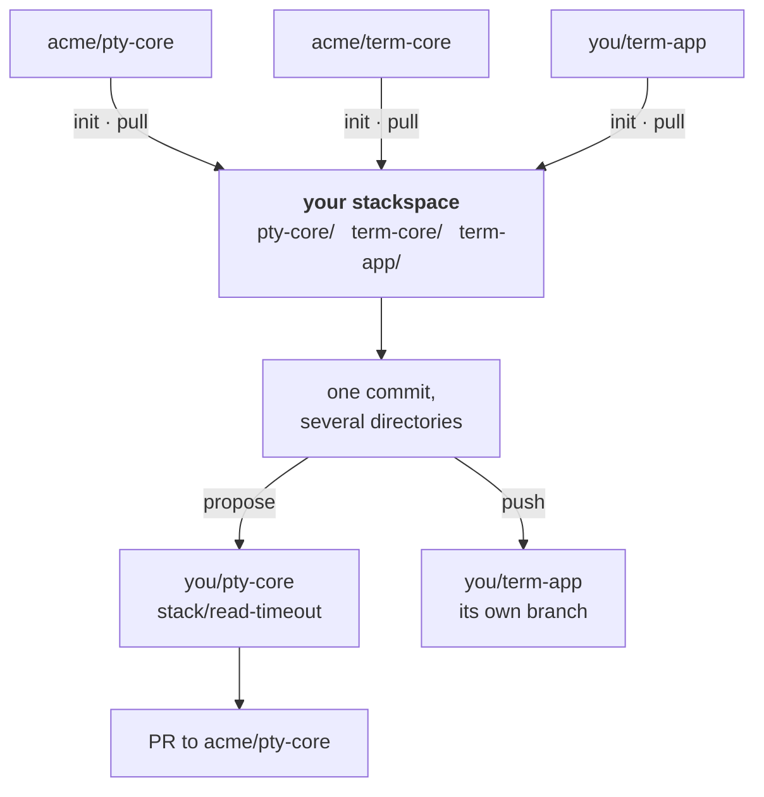
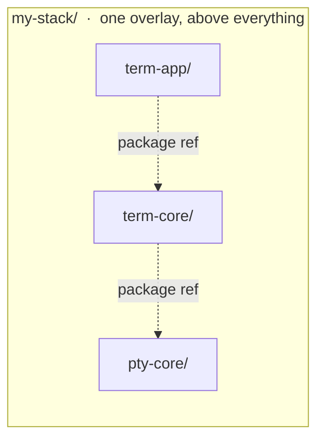
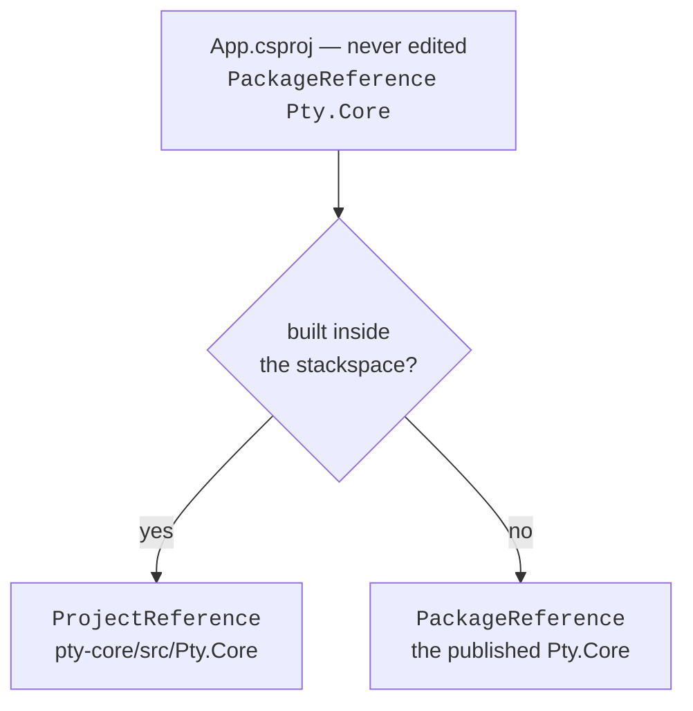

# Stackspaces

Some projects only make sense together — an app, and the libraries it depends
on that you have had to fork. Iterating across that boundary means publishing a
package to see a change land, and a change that spans the repos cannot be one
commit.

A **stackspace** fuses those repos — your app included — into one git
history, each under its own directory. A change spans them in a single commit,
the build compiles against source rather than packages, and every project still
leaves as itself: a pull request to a fork you contribute to, or a
fast-forward of a repository you own. Nobody downstream learns the stackspace
exists.

## The two halves

Two independent problems, two independent solutions. You need both, and they
know nothing about each other.

**The git half.** Each upstream repo's history is imported into one stackspace
repo, rewritten to live under a prefix directory. That is
[josh](https://josh-project.dev) doing reversible history filtering; rig drives
it as a throwaway localhost process and does everything else with plain git.
Because it is one repo, one commit can touch every project in it.

The whole round trip, for two of the repos:



Work arrives one way and leaves two, depending on whose repo it is going back
to. `propose` proposes a squashed commit on a branch of your fork, which is what a
maintainer reviewing someone else's project wants. `push` fast-forwards a
project you own with every commit that touched it, messages intact, which is the
only sane thing to do to a repository that is yours.

The engine is not involved everywhere. Import, `pull` and `push` all drive
josh's reversible filters — in one direction to nest a repo under a prefix, in
the other to take it out again. `propose` uses no engine at all: the directory's
tree is already what upstream wants, so the export is a plain `git commit-tree`
onto the upstream tip.

**The build half.** If the projects depend on each other through a package
registry, your edits do not reach the consumer without a publish cycle. A build
file sitting *above* the projects redirects those package references at the
sources next door — see [wiring the build](#build) below. No upstream-owned
file is modified, and no project file changes at all.

## Everything goes in the stackspace {#topology}

Your own project included. One repo, one build file, one commit that can span
all of it.

That is worth saying plainly, because the instinct is the other way round: keep
your app where it is, and have it reach into the stackspace for the libraries.
That does work. It also gives up the thing the stackspace exists for — a change
spanning your app and a library is two commits in two repos again — and it needs
a second build file that most people do not realise they need until something
silently builds against the published package.



A build overlay is found by walking *up* from a project, so it governs its own
directory tree and nothing else. Put every project in one tree and one file
redirects every dashed line above — including the ones between two libraries,
which is the pair people forget when their app sits outside.

Your app is a member like any other, with one difference you declare: mark it
`"owned": true` and `rig stack push` fast-forwards *its own* repo with your
commits, history intact, instead of proposing a squashed branch to a fork the
way [`propose`](#propose) does for somebody else's project.

::: warning A repo with its own root build file hides the overlay
MSBuild stops at the **first** `Directory.Build.targets` it finds walking up.
Your own app is the project most likely to have one — and if it does, the
stackspace overlay above it is never read, and every project underneath quietly
keeps building against published packages. Nothing warns you.

Have that file continue the walk-up:

```xml
<PropertyGroup>
  <!-- Resolved into a property first: a Condition is itself single-quoted, so
       the quotes this function needs cannot appear inside one (MSB4092). -->
  <StackParentTargets>$([MSBuild]::GetPathOfFileAbove('Directory.Build.targets', '$(MSBuildThisFileDirectory)../'))</StackParentTargets>
</PropertyGroup>
<Import Project="$(StackParentTargets)" Condition="'$(StackParentTargets)' != ''" />
```

It is a no-op outside a stackspace, where there is nothing above, so it is safe
to commit.
:::

## Setting one up

### 1. The stackspace is an ordinary git repo

It needs no remote and never gets one. Nothing is pushed *from* it except
through `propose`, which pushes to your forks.

```sh
mkdir ~/src/my-stack && cd ~/src/my-stack
git init -b main
```

### 2. Scaffold the manifest

The first `init` writes a commented skeleton and stops — it cannot guess your
repos. Fill it in, and the second `init` imports them.

```sh
rig stack init          # writes rig.stack.jsonc
```

Or skip the editing entirely. `rig stack add` asks for a repo, works out where
it goes, writes the entry and imports it — and every answer is also a flag, so
the same thing scripts:

```sh
rig stack add                                    # asks
rig stack add github.com/acme/pty-core --fork github.com/you/pty-core
rig stack add github.com/you/term-app --owned    # one of yours
```

Paste the URL if that is what you have; it is reduced to `host/owner/name`. The
rest of this section is what `add` writes, and what to write by hand if you
would rather.

```jsonc
{
  "$schema": "https://rigsmith.dev/schemas/rig-stack.json",
  // Branches `propose` creates are named stack/<what-you-typed>. Optional.
  "branchPrefix": "stack/",

  "repos": {
    "pty-core": {
      "upstream": "github.com/acme/pty-core",   // where PRs go
      "fork":     "github.com/you/pty-core",    // where `propose` pushes
      "upstreamBranch": "main"                  // branch of upstream to follow
    },
    "term-core": {
      "upstream": "github.com/acme/term-core",
      "fork":     "github.com/you/term-core",
      "upstreamBranch": "main"
    },
    // Your own project, fused like any other member. "owned" is what makes
    // `push` available for it — see Getting your changes out.
    "term-app": {
      "upstream": "github.com/you/term-app",
      "fork":     "github.com/you/term-app",
      "owned":    true
    }
  }
}
```

The key is the directory the project will live under. Repo specs are
`host/owner/name` — no scheme, no `.git` — because the same string has to serve
as a URL, an engine path, and a label.

`upstreamBranch` is the branch of **upstream** this directory follows: what
`pull` takes, and what `propose` roots its commit on. It is *not* the branch `propose`
creates — you name that one per change. Full key reference in
[Configuration](./configuration#stack).

### 3. Import

```sh
rig stack init

# pty-core: imported upstream a1b2c3d4
# term-core: imported upstream e5f6a7b8
# term-app:  imported upstream 9c0d1e2f
```

Each repo's history is fetched through its prefix filter and merged in. The
first run also acquires the josh engine. For the version rig pins, on a platform
it publishes for, that is a verified download and takes seconds; pin a different
`josh` version or work on a platform without a published binary and it falls
back to building from source, which takes minutes.

You now have one history, one directory per project, and a `lastSync` block in
the manifest recording the upstream commit each was taken from — written by the
import, and by every `pull` after it. Those cursors
are committed alongside the import, which is what makes a repeated `pull` a
no-op rather than a surprise.

### 4. Wire the build {#build}

This part has nothing to do with git, and what it looks like depends on your
ecosystem. The goal is the same everywhere: make every project compile against
the sources next door instead of a published package.

On .NET that is a single `Directory.Build.targets` at the stackspace root. MSBuild
imports it from the nearest ancestor directory of every project underneath, and
in a stackspace that is all of them.

`rig stack wire` writes this file for you, from what the ecosystem adapters
already know about the projects in the stackspace — which package each one
produces, and which of them are referenced across a member boundary. Those are
the ones that would otherwise come from a registry, and they are exactly the
ones it redirects. Re-run it after adding a member. It rewrites its own file and
refuses to touch one you wrote yourself.

What it writes, and what to write by hand if you would rather — each swap
declared once, the package name and where its sources are:

```xml
<Project>
  <ItemGroup>
    <StackSource Include="Pty.Core"  Path="pty-core/src/Pty.Core/Pty.Core.csproj" />
    <StackSource Include="Term.Core" Path="term-core/src/Term.Core/Term.Core.csproj" />
  </ItemGroup>

  <ItemGroup>
    <_StackAbsent  Include="@(StackSource)" Exclude="@(PackageReference)" />
    <_StackPresent Include="@(StackSource)" Exclude="@(_StackAbsent)" />
    <ProjectReference Include="@(_StackPresent->'$(MSBuildThisFileDirectory)%(Path)')" />
    <PackageReference Remove="@(StackSource)" />
  </ItemGroup>
</Project>
```

`Exclude` matches on identity, so `_StackAbsent` is every declared source a
project does *not* reference and `_StackPresent` is the complement — exactly the
swaps that project needs. Only actual consumers get rewired, which is what stops
`Pty.Core` gaining a reference to itself.

What that buys is one unedited project file with two possible resolutions:



No `.csproj` is edited, so nothing any project carries advertises the stackspace.
Clone any member on its own and it builds from packages exactly as it always
did — which is what its CI, and anyone you send a change to, will do.

Other ecosystems have their own version of this — an npm `workspaces` array,
a `go.work` file, a linked dependency. Nothing in `rig stack` depends on which
you choose.

#### Checking that it took

`rig stack doctor` reports the same findings `wire` does, without writing
anything. Both name every package that crosses from one member to another and
which way it goes — including library to library, the pair people forget,
because the app is not involved and nothing looks wrong.

Both also flag a member whose packages nothing here consumes. That is nearly
always one of two mistakes, and silent either way: the wrong repo was fused, or
the right one was and your code has since moved to a fork that renamed the
package. A package is matched by identity, not by where it came from, so a
stackspace like that imports, wires and builds while changing nothing.

`wire` goes one step further where it is allowed to. A member carrying its own
root `Directory.Build.targets` ends MSBuild's search there — see below — and for
a member marked `"owned": true` `wire` patches it, since the file is yours and
the line belongs committed. For a fork you contribute to it only reports: that
line would otherwise ride into somebody else's pull request as rig plumbing.

For a specific project, ask MSBuild what it actually evaluated. Do not infer it
from a build succeeding; a build that quietly used the package succeeds too:

```sh
dotnet msbuild App.csproj -getItem:PackageReference -getItem:ProjectReference
```

Each item carries a `DefiningProjectFullPath` naming the file that contributed
it, so you can confirm a reference arrived from the overlay rather than the
`.csproj`. A package you expected to vanish still listed there means the swap
missed it.

#### Things that will bite you

- **A member with its own root `Directory.Build.targets` hides the overlay.**
  The most important one, and covered [above](#topology): the walk-up stops at
  the first file it finds, and everything under that member keeps building
  against packages with no warning at all.
- **Match on `Identity`, never `Filename`,** if you hand-write conditions
  instead of using the form above. MSBuild splits `Filename` at the last dot, so
  `Pty.Core.Native` has the `Filename` `Pty.Core`: a condition meant for one
  package matches its sibling and looks like it worked. The `Exclude` form never
  names a metadata field, so it cannot go wrong that way.
- **`ItemGroup` is a child of `Project`.** Nested inside `PropertyGroup` it
  gives you `MSB4004: The "ItemGroup" property is reserved`, which does not
  sound like what it means.
- **Swapping a package for a project reference can break a publicizer.**
  Anything that reaches a dependency's internals — `IgnoresAccessChecksToGenerator`
  and friends — rewrites `@(ReferencePath)`, but the compiler reads
  `@(ReferencePathWithRefAssemblies)`. Those are the same items for a package and
  *different* for a project reference, which produces a reference assembly. The
  publicized copy is built and then ignored, and every internal it was meant to
  expose comes back as `CS0122`. Set `ProduceReferenceAssembly` to false on that
  member.
- **Nothing warns you when part of an overlay does nothing.** Removing a
  `PackageReference` for something that is actually a `ProjectReference` — a
  vendored copy, say — is valid MSBuild and a silent no-op. Delete blocks that
  turn out not to apply, because they read as working.

::: tip Fusing a library your code pins to an old release
If a member's sources no longer compile against the rest of the stackspace, the
build wiring is usually not the problem — the *imported point* is. A library you
depend on at an older release has to be fused at that release, not at a tip
whose API has moved on. Pin it with
[`upstreamTag` or `upstreamCommit`](./configuration#stack).
:::

## The daily loop

There is nothing special about it. It is one repo, so you work in it like one
repo.

```sh
# change a library and the app that calls it, together
$EDITOR pty-core/src/Pty.Core/PtyConnection.cs
$EDITOR term-app/src/Terminal/Session.cs

rig build          # compiles against source, no publish cycle
git commit -am "fix the read timeout and the app that hit it"
```

One commit spanning your app and a forked library, and the build proved it works
end to end before you committed. No version bump, no publish, no waiting for a
feed. That is the whole point of the exercise, and it is the part you lose if
your app lives outside the stackspace.

## Getting your changes out

A commit in the stackspace can touch several projects. Getting it to each of them
is one command per project — and which command depends on whose repository it
is.

### Your own projects: `push` {#push}

For a member marked `"owned": true`, `push` fast-forwards that project's own
branch with every stackspace commit that touched it:

```sh
rig stack push term-app
rig stack push            # the same, when only one repo here is yours

# pushed term-app to you/term-app:main (0b001bd3)
```

Nothing is squashed. Each commit arrives with its own message, parented on what
the repo already had — so a change spanning your app and a library lands as a
matching commit in each, and commits that touched nothing in that directory do
not appear at all. It works by running the exact inverse of the filter the repo
was imported with, so the history you share with upstream comes back as its own
commits and yours sit on top as a fast-forward.

Pushing also brings the result back into the stackspace before it returns. The
commit that leaves is necessarily a different object from the one that produced
it — the same content, under a different prefix, with different parents — so the
stackspace ends up holding both shapes of a cross-project change: your commit
spanning several projects, and the single-project commit the repo received. That
is the honest cost of one history being several, and taking it back at push time
is what stops a later `pull` re-importing your own work as a parallel line of
development.

### Somebody else's: `propose` {#propose}

One `propose` per project. Each produces a branch on **your fork** holding a single
commit whose diff is exactly what you changed in that directory, rooted on the
current upstream tip.

```sh
rig stack propose <repo> <new-branch>

rig stack propose pty-core read-timeout -m "Fix the read timeout"
rig stack propose term-core read-timeout -m "Handle the new timeout"

# sent pty-core to you/pty-core:stack/read-timeout
#   — open the PR against acme/pty-core
```

The branch holds that project's files at their real un-prefixed paths —
`src/Pty.Core/…`, not `pty-core/src/…` — with no sign the repo is fused with
anything, and none of the stackspace's own history for a maintainer to read
around. Open the PR from your fork as usual.

`<new-branch>` is a branch you are creating on *your fork*, named per change.
Nothing reads it from the manifest, because it is a property of the change
rather than of the project — which is also why the `rig ui` flow asks for it.

What you type is prefixed with **`stack/`**, so `read-timeout` becomes
`stack/read-timeout`. Your fork also carries your own branches; the prefix keeps
these apart from them at a glance, and makes a collision with a name
already on the fork far less likely — though a prefix reserves nothing, and a
fork may already carry `stack/<name>`. Change it with `branchPrefix` in the manifest,
per stackspace or per repo, or set it to `""` for bare names. A name that already
starts with the prefix is left alone, so pasting a full branch name back in when
proposing again does not stutter it.

Sending again to the same branch **updates** it, so you can act on review
feedback: commit in the stackspace, propose again, and the pull request moves. The
branch is replaced under a lease taken at the moment of the push, which guards
against a race between reading the branch and writing it — it is not a record of
what you last sent, so it will not tell you that someone rewrote the branch
between one proposal and the next.

::: warning `propose` refuses a stale cursor
Your stackspace tree is a snapshot taken at the last `pull`. If upstream has
moved on since, committing that tree onto the newer tip would present every
commit that landed in between as though your branch had **reverted** it. `propose`
stops rather than build such a branch — run `rig stack pull <repo>` and propose
again.
:::

## Taking upstream's changes

```sh
rig stack status              # who has moved, per repo
rig stack pull pty-core       # take one
rig stack pull                # take all of them
```

A pull merges the new upstream commits into that repo's directory, so a conflict
is scoped to the project that caused it rather than landing across the whole
stackspace. The cursor only advances once the merge is committed.

A [pinned](./configuration#stack) project has nothing to take: its tag was
resolved once, and an upstream that later re-cuts that tag does not move you.
Edit the pin to go somewhere else, or `rig stack pull --repin` to follow a moved
tag deliberately.

Moving a pin *backwards* — to a release older than the directory currently holds
— cannot be a merge, since the target is already an ancestor. The directory is
replaced with the pinned revision instead, reported as `moved`, and refused
outright if it holds changes of its own.

## Taking a repo back out

Not every repo that looks fusable can be *built* fused, and that tends to
surface only after the import — a consumer that reads another member's
internals through a publicizer, say, which needs a compiled assembly and finds a
project reference instead. The honest answer there is that the repo should not
be a member, and `rm` is how you say so:

```sh
rig stack rm pty-core
rig stack rm pty-core --keep-tree    # leave the directory; it just stops being a member
```

Removal touches three things, and only one of them is visible, so it does all
three and says which: the manifest entry and its cursor go; the directory is
deleted from the tree (or kept, with `--keep-tree`, as an ordinary part of this
repository); and the build overlay is rewritten from the members that remain —
or removed outright when nothing crosses between them any more — so no build
file keeps a `ProjectReference` into a directory that is no longer there. The
result is one commit. Nothing outside the stackspace changes: the upstream and
your fork are exactly as they were, and `rig stack add` fuses the repo again.

A repo holding work that has not left the stackspace is refused, because that
work exists nowhere else — the same `unsent changes` and `uncommitted changes`
that `status` reports, plus the case where the comparison cannot be made at
all. `--force` removes it anyway.

## The verbs

| Verb | What it does |
|---|---|
| `stack init` | Scaffold the manifest, or import the repos it names that are not imported yet |
| `stack add [upstream]` | Add a repo to this stackspace and import it; asks when not given |
| `stack rm <repo>` | Remove a repo: its manifest entry and cursor, its directory, and the overlay redirects into it; refuses while it holds work that has not left (`--force`), `--keep-tree` keeps the directory |
| `stack status` | Each repo's cursor against its upstream branch tip |
| `stack pull [repo]` | Merge new upstream commits into a repo's directory (all repos by default) |
| `stack propose [repo] [new-branch]` | Put that repo's changes on your fork as a PR-ready branch |
| `stack push [repo]` | Fast-forward a repo you own with this stackspace's commits, history intact; inferred when only one is yours |
| `stack wire` | Write the build overlay so members resolve each other from source |
| `stack doctor` | Check the engine and manifest; `--fix` installs what is missing |

`propose` and `push` answer different questions. `propose` proposes one squashed
commit on a branch of your fork, which is what a reviewer of someone else's
project wants. `push` fast-forwards a project's *own* branch with every commit
that touched it, messages intact, which is the only sane thing to do to a
repository that is yours — mark it `"owned": true` to enable it.

All of it is in [`rig ui`](./verbs) too, under **▸ Stack** — `propose` there picks
the repo from the manifest and prompts for a branch name, and `push` offers only
the repos marked as yours. Tab completion offers
your repo names for the verbs that take one.

## The engine

Importing, pulling and pushing are done by [josh](https://josh-project.dev), the
git history-filtering engine — `josh-proxy` serves a repo's history through the
filter for `init` and `pull`, and `josh-filter` runs the inverse locally for
`push`. `propose` needs neither.

Private upstreams work, and need no setup. Because the engine is what talks to
upstream, it is the engine that has to authenticate: rig asks git for the
credential you already have for that host — the keychain, the GitHub CLI's
helper, whatever `git credential fill` answers with — and hands it over for that
one fetch. Nothing new is stored, and rig asks for nothing of its own: terminal
prompting is off for the lookup, so a host nothing has a credential for is
simply answered "no". An askpass program you configured yourself can still
appear, exactly as it would for a direct `git fetch` of the same host.

rig owns the binaries so you do not have to. `rig stack doctor --fix` fetches
verified builds for your platform — built and published by
[rigsmith/josh-binaries](https://github.com/rigsmith/josh-binaries), since
upstream ships no releases — falling back to building it from source where none
exists. Nothing runs in the background: the engine starts per operation and
stops after. Pin a version per stackspace with the manifest's
[`josh` key](./configuration#stack).

## Things worth knowing before they bite

- **A member built on its own still builds from packages.** No project file
  changes, so a clone of any one repo resolves its dependencies from the
  registry exactly as it always did — which is what its CI does, and what
  anyone you send a change to will do. The corollary is that code depending on
  something you added in a fork but have not published yet compiles inside the
  stackspace and nowhere else. That is fine while the change is in flight and a
  trap if you forget it.
- **A clean worktree is required** for `init`, `pull`, `propose`, and `push`. An import
  amends its merge commit and stages everything, so an unrelated edit sitting in
  the tree would be swallowed into it. The one exception is a dedicated
  `rig.stack.jsonc` on first import, since filling it in and re-running is the
  documented flow — an inline `stack` block in `.rig.json` gets no exception,
  because waving that file through would commit whatever else it holds.
- **The stackspace root is the git top level**, so the verbs work from anywhere
  inside it — including from within one of the imported projects, which carries
  its own package manifest and would otherwise look like the root.
- **The stackspace is disposable — once your work has left it.** The fused
  history is a working convenience, not an archive, so a tangled one can be
  deleted and re-imported. But a commit you have not sent or pushed exists *only*
  there. `status` flags a project holding work that has not left — `unsent
  changes` for commits, `uncommitted changes` for edits still in the tree — so
  check it before deleting anything. That comparison is local, so it still
  answers when upstream is unreachable, which is exactly when you are most
  likely to be tidying up. It reports what has *changed*, not what has reached a
  fork: neither verb leaves a record, so a project stays flagged until upstream's
  own history moves on.
- **Do not give the stackspace a remote** and push it somewhere. It contains
  several rewritten upstream histories fused together, which is meaningful to
  you and to nobody else.
